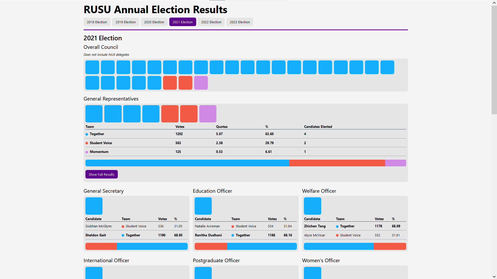

# rusu-election-results

This is a web app which displays the results of the RMIT University Student Union annual elections
in a graphical format.

It shows the overall composition of the council, as well as detailed results for each council
officer position and the general representatives for each election from 2018-2023. Data was sourced
from the [RUSU website](https://rusu.rmit.edu.au/), with the assistance of the Wayback Machine to
retrieve some older results.

